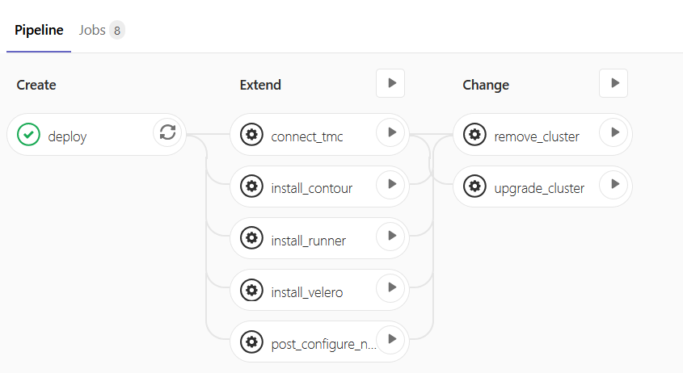
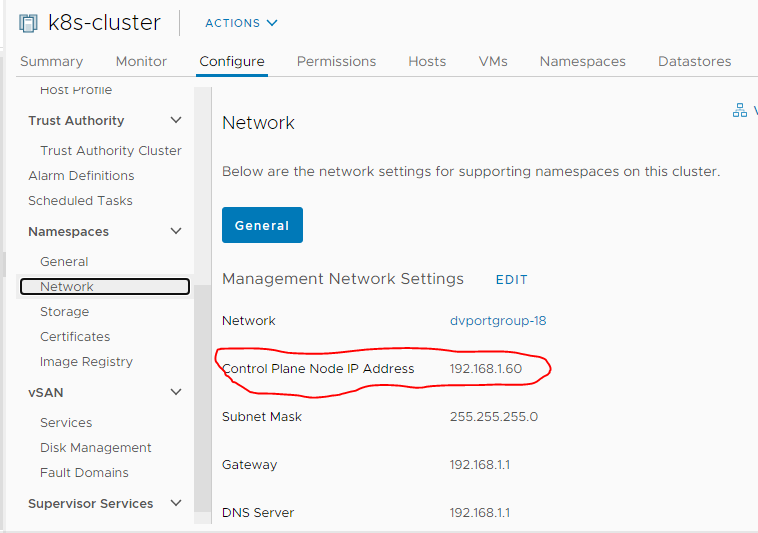
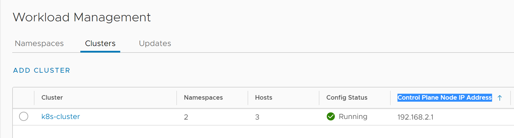

# Gitlab CI for Tanzu Kubernetes clusters on VSphere 7 with Kubernetes

Show using Gitlab CI to CRUD Tanzu Kubernetes clusters on vSphere with Kubernetes. Kept relatively simple using nothing fancy: `Bash , ssh, curl. Helm, Kubectl, jq/yq, velero, TMC cli and nsenter` so the job scripts can be used elsewhere.

## The pipeline

All the jobs are set to trigger only on changes to [tkg-cluster.yaml](tkgclusters/tkg-cluster.yaml) on `master`.

Only `deploy` is automatic. All others are manual and can be run in any order.

Setting the `DRYRUN` variable to `YES` will create the pipeline but do nothing except run [commonsetup.sh](common/commonsetup.sh). Which uses snippets from jmanzaneque@vmware.com's  https://github.com/josemzr/vsphere-k8s-scripts to get the SC Kubeconfig, which is then used for pretty much everything

(Almost) Everything uses *kubectl* so in theory idempotent eg rerun after upgrade. YMMMV.

Since the TKG cluster is the centrepiece eveything runs in the context of the `tkgclusters` directory.

## Variables set in Gitlab
`DRYRUN` : *Yes/No* see above note.

`RUNNER_TOKEN` : See note for **install_runner** below.

`TCL_NEW_VER`: Set it to the short version to upgrade the cluster to eg. **v1.17.8**. See note for **upgrade_cluster** below.

`TMC_API_TOKEN`, `TMC_GRP` , `TMC_ORG` : Tanzu Mission Control connection details.

`CREDS_VELERO`: A file with the S3 bucket credentials.

## Basic flow
### STEP 1 
Edit the `SV_IP, VC_IP, SV_MASTER_IP,VC_ADMIN_USER, VC_ADMIN_PASSWORD` values , `NAMESPACE` and `CLUSTERNAME` in [common/getsckubeconfig.sh](../common/getsckubeconfig.sh)

[common/getsckubeconfig.sh](./common/getsckubeconfig.sh) uses snippets from jmanzaneque@vmware.com's [excellent scripts](https://github.com/josemzr/vsphere-k8s-scripts) to get the SC kubeconfig.

`SV_MASTER_IP=192.168.1.60` which is from:

SV_IP='192.168.2.1` which is the  `Control Plane Node IP Address` from the Workload Management -> Clusters page

This is then used as "sc.kubeconfig' in [commonsetup.sh](../commonsetup.sh) to get the Tanzu Kubernetes cluster details.

### Step 2
Edit [tkg-cluster.yaml](tkgclusters/tkg-cluster.yaml) , commit, push.
See  [Readme.md](tkgclusters/Readme.md) for details

# Notes on various files
## [deploy](.gitlab-ci.yml)
Creates a cluster and spits out the link to the CLI and the login command.

## [post_configure_nodes](.gitlab-ci-postconfig_nodes.yml)
Runs `nsenter` in a pod on each node of the cluster to add the embedded Harbor certs and restart containerd. **Note that this will not work for v1.16.8 clusters.**
The command nsenter runs can be easily changed. See [tkcnodeconfigure/Readme.md](tkcnodeconfigure/Readme.md) for details.

## [install_contour](.gitlab-ci-contour.yml)
Installs contour. The [contour manifest](contour-ingress/install-contour.yaml) is modified to suit v7k8s, including the storage class.

## [install_runner](.gitlab-ci-runner.yml)
Installs a Gitlab Kubernetes runner using the Gitlab Helm chart. Change the `RUNNER_TOKEN` value to connect to appropriate Gitlab project/instance. Spits out all the details needed to [configure cluster connection in Gitlab[(https://docs.gitlab.com/ee/user/project/clusters/add_remove_clusters.html#add-existing-cluster)].

## [remove_cluster](.gitlab-ci.yml)
Removes cluster.

## [upgrade_cluster](.gitlab-ci.yml)
In theory editing the `version`/`fullVersion` in [tkg-cluster.yaml](tkgclusters/tkg-cluster.yaml) and re-applying should be the way, but it isn't so using the [patch method](https://docs.vmware.com/en/VMware-vSphere/7.0/vmware-vsphere-with-kubernetes/GUID-DF2B3886-4BE0-4E88-B549-DC9C1C653FDB.html#GUID-DF2B3886-4BE0-4E88-B549-DC9C1C653FDB__GUID-6614C83F-2F58-4F10-BDB2-BAB237D12743). 

## [install_velero](.gitlab-ci-velero.yml) 
Installs Velero into cluster.

## [connect_tmc](.gitlab-ci-tmc.yml) 
Connects cluster to Tanzu Mission Control
