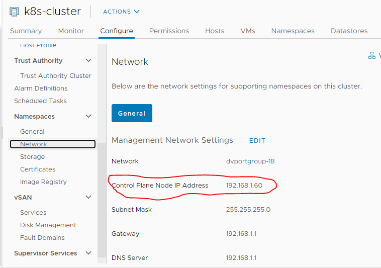

# one way to do **something** on the TKC nodes 
this could be used for any k8s cluster but this is specifically used to add the embedded harbor cert to the TKC worker nodes.
uses nsenter in a pod on the TKC worker node instead of SSH.

## First Get Supervisor Cluster kubeconfig
[common\getsckubeconfig.sh](../common/getsckubeconfig.sh) uses snippets from jmanzaneque@vmware.com's [excellent scripts](https://github.com/josemzr/vsphere-k8s-scripts) to get the SC kubeconfig.

`SV_MASTER_IP=192.168.1.60` which is from:




SV_IP='192.168.2.1` which is the  `Control Plane Node IP Address` from the Workload Management -> Clusters page


This is then used as "sc.kubeconfig' in [do_clusternodes.sh](do_clusternodes.sh) to get the TKC worker nodes and the TKC kubeconfig.

To run ;
1. edit the `SV_IP, VC_IP, SV_MASTER_IP,VC_ADMIN_USER, VC_ADMIN_PASSWORD` values , `NAMESPACE` and `CLUSTERNAME` in [common\getsckubeconfig.sh](../common/getsckubeconfig.sh)
1. edit the `NAMESPACE` and `CLUSTERNAME` in [do_clusternodes.sh](do_clusternodes.sh)
1. ../common/getsckubeconfig.sh
1. ./do_clusternodes.sh

## [nsenter-node.sh](nsenter-node.sh) can also be run on it's own
1. set KUBECONFIG to the TKC kubeconfig (see [do_clusternodes.sh](do_clusternodes.sh)) for how to get that or just run with kubectl context set to TKC context
2. Get the TKC node of interest eg ` kubectl get nodes`
3. ./do_clusternodes.sh <nodename>

## Changing what [nsenter-node.sh](nsenter-node.sh) does

just edit the command passed to nsenter, keeping in mind it execs as root

```
          "/nsenter", "--all", "--target=1", "--", "bash", "-c", "curl -k https://192.168.2.3/api/systeminfo/getcert -o harbor.ca.cert && cat harbor.ca.cert >> /etc/pki/tls/certs/ca-bundle.crt && systemctl restart containerd.service"
```
